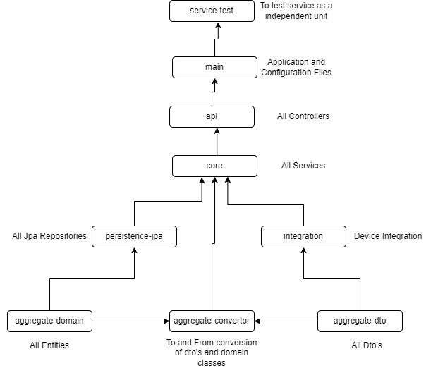

# Maven Modules

## aggregate
### dto
The dto module contains the data transfer objects that are used to communicate between client and service. These objects will also be used for intra service communication.
### domain
The domain module contains the domain classes that are used to validate all the business logics.
### convertor
The convertor module is responsible for converting domain classes to their respective dto classes and vice-versa.

Depends on:
- **dto**
- **domain**

## integration
The integration module provide abstraction over third party integration like communicating with the Iot devices and communicating with message brokers. 

Depends on:
- **dto**

## main
The main module contains the executable main class and the service configuration. Its purpose is to wire everything together.
- Contains spring boot main class.
- Configuration settings.
- Packages to scan.

Depends on:
- **api**

## api
The api module exposes the rest endpoints. The rest controller calls services in the core module.

Depends on:
- **core**

## core
The core module is the engine of the service. It contains services that are responsible for the business logic of the application.
- Calls persistence-jpa to persist domain objects.
- Calls messaging broker for events

Depends on:
- **persistence-jpa**
- **integration**

## persistence-jpa
The persistence-jpa module contains generic interfaces used by the core module to persist domain objects.

Depends on:
- **domain**

## service-test
The service-test module contains integration tests to test the service as a black box.

Depends on:
- **main**

