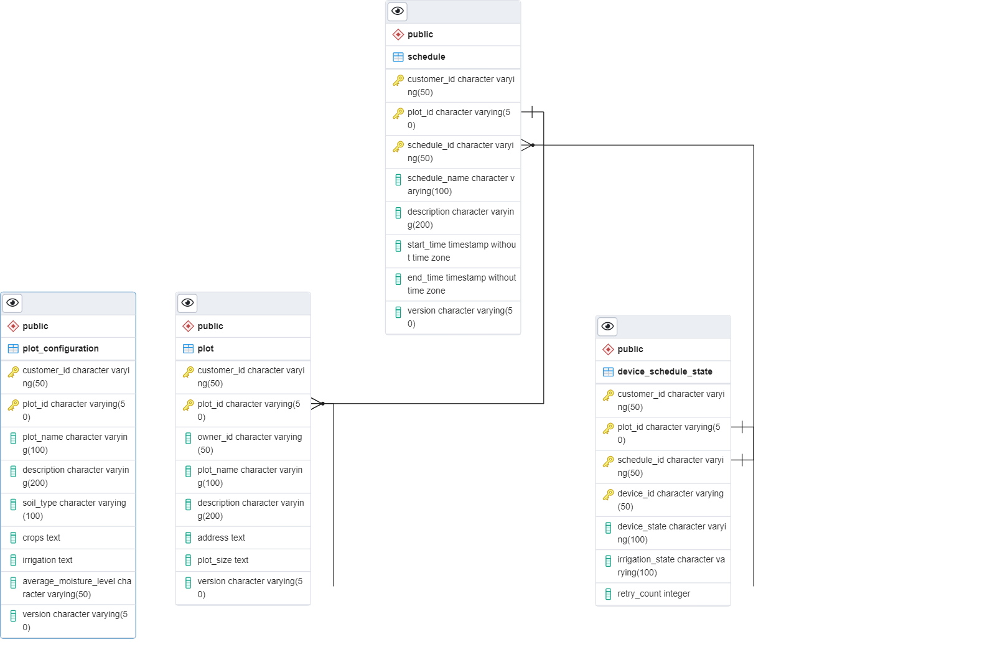
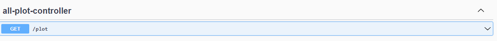
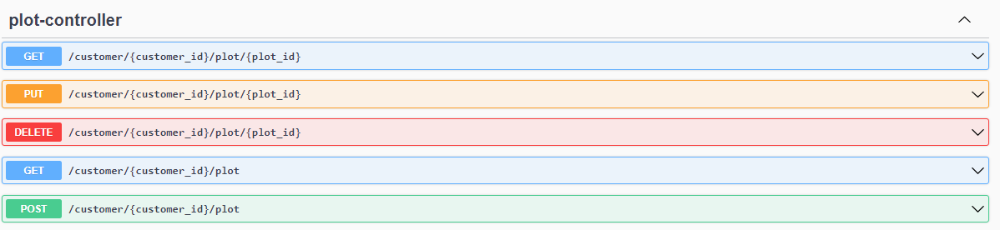
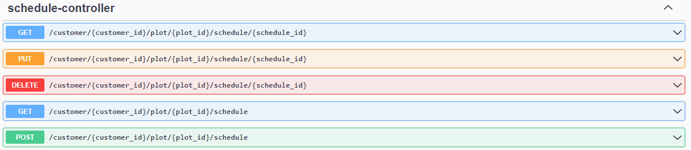
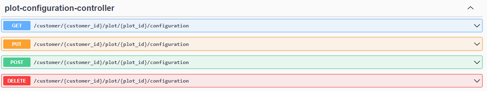
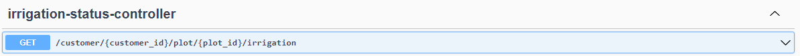

# Irrigation Service
* [Overview](#Overview)
* [Entity Relationship Diagram](#EntityRelationshipDiagram)
* [API Specifications](#APISpecifications)
* [Terms and Definitions](#TermsAndDefinitions)
* [Maven modules](MAVEN_MODULES.md)
* [Installation & Deployment](INSTALLATION_AND_DEPLOYMENT.md)
* [Postman Collections](Irrigation.postman_collection.json)
* [Technology Stack](#TechnologyStack)

## <a name="Overview">Overview</a>
A spring-boot service based on JAVA to manage the automatic irrigation of agricultural lands without human intervention. Following business requirements are catered:
* Managing the plots of land
* Configuring the time slots and amount of water required for efficient irrigation.
* Providing an integration interface for the Iot-devices
* Managing status of the irrigation based on the commands sent to Iot devices wrt to time-slots.
* Retry mechanism for sending the commands to Iot devices if devices doesn't respond. 
* Generating Alerts based on Iot devices availability and number of retries. 
* Seed data generation is configured in application.yml file. 

## <a name="EntityRelationshipDiagram">Entity Relationship Diagram</a>


## <a name="APISpecifications">API Specifications</a>





After running the application, all relevant API specifications details can be found at below URL.
```bash
http://localhost:9091/swagger-ui/index.html
```


## <a name="TermsAndDefinitions">Terms and Definitions</a>
| Term | Definition |
| --- | --- |
 | Aggregate | Consists of all pojo's such as dto's and entity classes|
| DTO | Data Transfer Object|
| Domain | Entity classes used for database|


## <a name="TechnologyStack">Technology Stack</a>
The application is built upon Java, J2EE and Spring framework-based technology stack.

| Area                   | Technology Used |
|------------------------|-------------|
| JAVA                   | JDK 17      |
| Framework              | Spring boot |
| Database               | Postgres    |
| Source Code Management | GIT         |
| Application Server     | 	Tomcat     |
| Build Tool             | 	Jenkins    |
|Static Code Analyzer 	|Sonar, Checkstyle|
|Bug Tracking	|JIRA|
|Unit testing	|JMockito Framework|


